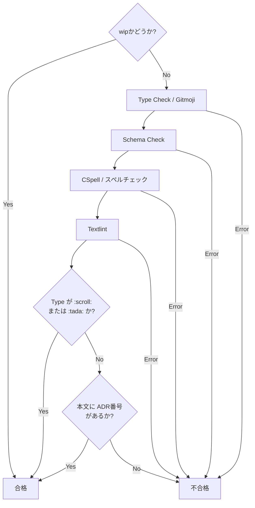

# For Developers

## コミットメッセージ規約

本プロジェクトでは、変更の背景（Why）を明確にし、意思決定の履歴を追跡可能にするため、以下の規約を定めます。

### 基本構成

コミットメッセージは、**Gitmoji（ASCII形式）**、**スコープ**、**要約**、および**ADR番号（本文）**で構成します。

#### ヘッダー形式

ターミナル環境等のフォント依存を避けるため、絵文字は常に **ASCII（例: `:sparkles:`）** で記述します。
これらは `commitlint` によって自動チェックされます。

* **Pattern:** `/^(:[a-z_]+:) (\(([a-z]+)\))?(.*)$/`
* **制約:** type（Gitmoji）および scope は小文字のASCIIのみ

#### 本文（Body）

原則として、変更の根拠となった**ADR番号**を以下の形式で記述してください。

> `#ADR番号`（例: `#A1234`）

以下のケースに該当する場合、本文へのADR番号の付与は不要です。

1. **初期化・ドキュメント作成:**
    * `:tada:` (プロジェクトの初期化)
    * `:scroll:` (ADRの追加・更新そのもの)
2. **作業中（スピード優先）:**
    * `wip` プレフィックスが含まれる場合

### コミットフロー

コミット時のバリデーションおよびフローは以下の通りです。

### 導入の目的とメリット

**意思決定の統計化:**
    どのADR（意思決定）に基づいてどの程度のコードが書かれたかを統計的に集計可能になります。
**進捗の可視化:**
    「ADRは発行されたが、実装が伴っていない」といった、滞っている意思決定を `git log` から容易に特定できます。
**トレーサビリティの確保:**
    「なぜこのコードになったのか」を、コードからADRへ、ADRからコードへと双方向に遡ることができます。
